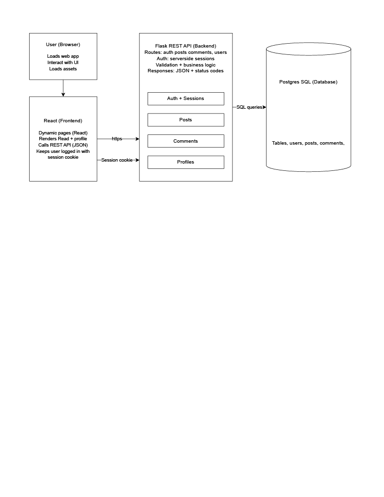

# InstaDynamic


## Overview
**InstaDynamic** is a full-stack web application that delivers a high-fidelity Instagram experience using client-side dynamic rendering. By refactoring a traditional server-side architecture into a modern **React frontend** and a **Flask REST API**, this project supports advanced features like infinite scroll and real-time interaction without page reloads.

## Table of Contents
- [Overview](#overview)
- [Features](#features)
- [Architecture](#architecture)
- [Quickstart](#quickstart)
- [Usage](#usage)
- [FAQ](#faq)
- [Tech Stack](#tech-stack)

## Features
- **Robust Authentication:** Secure access via session-based logins and HTTP Basic Auth.
- **Dynamic Feed:** Infinite scroll functionality that loads 10 posts at a time as the user reaches the footer.
- **Instant Engagement:** Immediate UI updates for likes and comments without page refreshes.
- **Advanced UI Elements:** Double-click to like and human-readable timestamps that update every minute.

## Architecture
### System Overview

*This diagram demonstrates the decoupled architecture where the React client makes asynchronous AJAX calls to the Flask REST API using the Fetch API.*

### Data Flow Detail

*A deep dive into how the backend orchestrates data between the SQLite3 database and the client, specifically handling JSON responses for posts, comments, and likes.*


## Quickstart

### Prerequisites
- **Node.js**: For managing frontend dependencies and the Webpack build tool.
- **Python 3**: To run the Flask development server.
- **SQLite3**: For local data storage.

### Installation
1. **Clone the repository**:
   ```bash
   git clone <your-repo-url>
   cd p3-insta485-clientside
   ```
2. **Install backend dependencies**:
   ```bash
   pip install -r requirements.txt
   ```
3. **Install frontend dependencies**:
   ```bash
   npm ci
   ```
4. **Set up the database**:
   ```bash
   ./bin/insta485db reset
   ```
5. **Start the development servers**:
   ```bash
   ./bin/insta485run
   ```

## Usage

### Creating a Post
Users can seamlessly upload photos to the platform. 


### Dynamic Interaction
Liking and commenting occur instantly. For instance, double-clicking an image or pressing "Enter" on a comment updates the UI immediately.


## FAQ
**How does authentication work?** InstaDynamic supports both server-side session cookies and HTTP Basic Access Authentication, which encodes credentials in the request headers.

**Does this project require a heavy database setup?** No, it uses **SQLite3**, a lightweight, file-based database that requires no separate server process.

**What happens if the API is slow?** The React frontend is designed with conditional rendering to show "Loading" states, ensuring the app remains stable while waiting for data.

## Tech Stack
- **Frontend**: React (Hooks/State), JavaScript (ES6), HTML5, CSS3.
- **Backend**: Flask, Python.
- **Database**: SQLite3.
- **Tools**: Webpack, ESLint, Cypress (E2E Testing).
